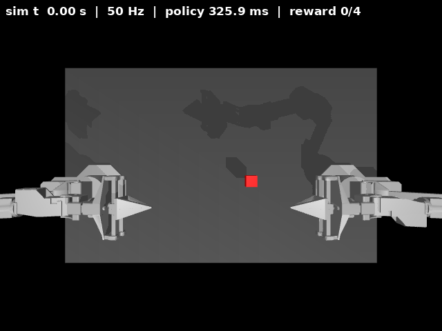
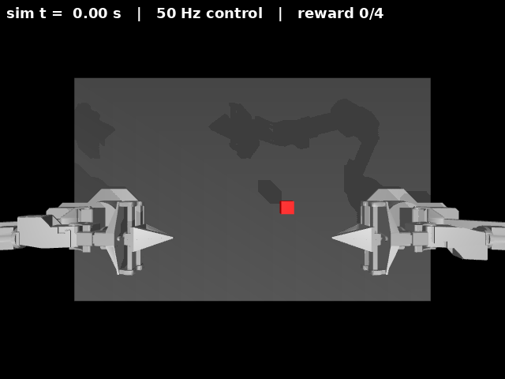
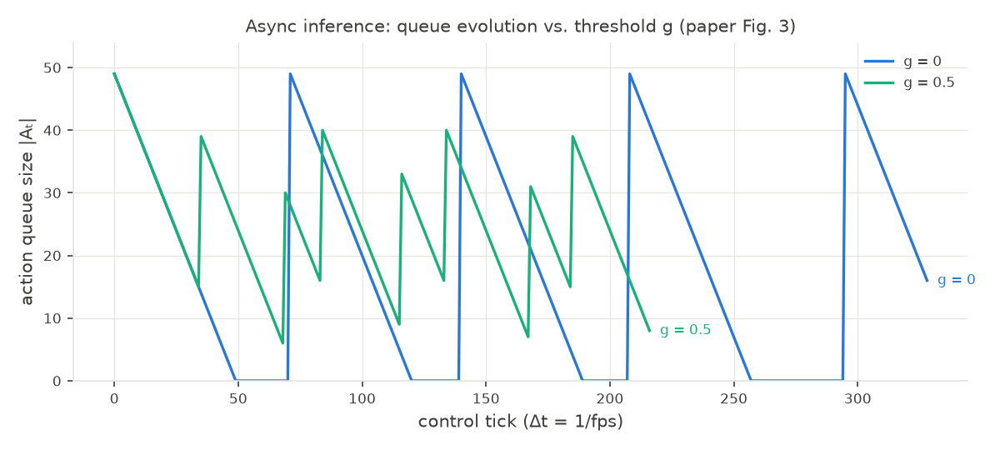
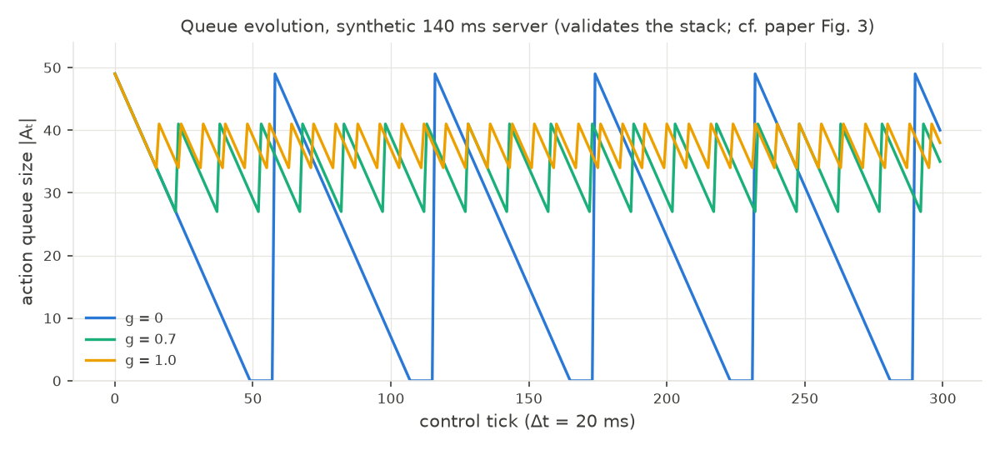
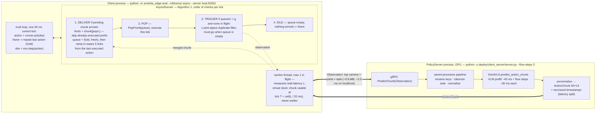

# SmolVLA on the Edge — Deploying a Flow-Matching VLA on 8 GB Jetson Xavier NX

Fine-tune [SmolVLA](https://huggingface.co/lerobot/smolvla_base) on a public SO-101
manipulation dataset, then **deploy and benchmark it on a Jetson Xavier NX (8 GB)** — the
part most tutorials skip.

> **The thesis of this repo:** fine-tuning a VLA is table-stakes. The interesting,
> portfolio-worthy engineering is getting a SmolVLM-2 + flow-matching-expert policy to run
> under real-time, on-device, 8 GB edge constraints — and being honest about *what converts,
> what doesn't, and the latency budget you hit anyway.*

No robot arm required: SmolVLA fine-tunes from public Hugging Face datasets, and evaluation
runs **closed-loop in the gym-aloha MuJoCo simulator** (plus open-loop replay as a fallback).
The Xavier NX edge phase is fully specced and kicks in whenever a Jetson is on hand.

---

## Demo — the fine-tuned SmolVLA doing the task, with its latency on screen



**What you're watching.** This repo's **fine-tuned SmolVLA** completing the bimanual cube
transfer **closed-loop** in `gym_aloha/AlohaTransferCube-v0`, rendered by the eval harness
(`scripts/make_demo_gif.py --mode rollout`). Not a replayed demonstration — every action is
produced by the network from the current camera image + joint state.

- **Model:** SmolVLA, 450 M params (SmolVLM-2 backbone + flow-matching action expert),
  language-conditioned — instruction: *"Pick up the cube with the right arm and transfer it
  to the left arm."*
- **Fine-tune:** single **Colab A100**, **20 k steps**, batch 64, **~2.5 h**
  (`notebooks/colab_train_smolvla_aloha.ipynb`)
- **Scene:** two ViperX arms (14 DoF total), one 480×640 top camera
- **Result:** **70 % success** over 20 episodes — vs 65 % for the ACT baseline (see Results)

**Timing, plainly.** The robot runs a **50 Hz control loop**: it needs one action every
**20 ms**. SmolVLA does not run its network every step — one full inference produces a
**chunk of 50 actions**, which are then executed one per control step. So each control step
is one of two kinds (all times measured on the RTX 2000 Ada by the CUDA-synced per-step
timer shown in the GIF header):

- **Replay step (49 out of every 50): ~5–7 ms.** The robot executes a precomputed action
  from the chunk — **no neural network runs**. The 5–7 ms is purely our harness preparing
  the *next* observation (camera image → tensor → GPU, tokenize the instruction, normalize).
  On these steps that preparation is even discarded — a known optimization to reclaim.
- **Inference step (1 out of every 50): ~300 ms.** The full model runs once: the SmolVLM-2
  backbone encodes image + instruction + state, then the flow-matching action expert
  integrates 10 steps to produce the next 50 actions.

The arithmetic that follows from this:
- 50 actions ÷ 50 Hz → **one chunk covers exactly 1 s of robot motion**, so the full
  network runs **once per second** — that (and nothing else) is the "VLM at 1 Hz" claim.
- 300 ms ÷ 50 actions = **6 ms of compute per executed action**, under the 20 ms budget —
  the GPU keeps up on average.
- But at each inference step the robot would stand still for **300 ms = 15 missed control
  ticks** if prediction and execution were serialized. Decoupling them (compute the next
  chunk while the current one is still executing) hides the stall — doing that within 8 GB
  is Phase 2's job.

For comparison, the **ACT baseline** (~52 M task-specific specialist) through the identical
harness — far cheaper per step, but no language conditioning and a lower success rate (see
Results):



**The header, field by field:**

| field | meaning |
|---|---|
| `sim t` | simulated time (steps × 20 ms). On a physical robot this trajectory would take the same wall-clock time — the whole handover is ~6.5 s |
| `50 Hz` | the control loop: one action consumed every 20 ms of sim time |
| `policy X ms` | wall time to obtain **that step's** action (CUDA-synced, RTX 2000 Ada). SmolVLA: ~5–7 ms queue pops, **~300 ms** chunk-boundary refills. ACT baseline: ~1 ms pops, ~14 ms refills. That pop-vs-refill rhythm *is* action chunking |
| `reward N/4` | gym-aloha's contact-based progress ladder: 1 = right gripper touches the cube, 2 = lifted off the table, 3 = left gripper touches it, 4 = left arm holds it alone → **SUCCESS**. An episode counts as a success iff it reaches 4 |

After success the sim runs ~1.5 s longer (so the GIF doesn't cut at the handover instant) and
holds the final frame. Regenerate with any checkpoint:
`python scripts/make_demo_gif.py --mode rollout --policy-path <ckpt> --task "<instruction>"`.

---

## Why this project

The role this targets emphasizes *real-time / on-device / edge constraints* and *strong
latency on real robots*. Almost every SmolVLA example deploys to a workstation or a physical
arm; very few tell the **8 GB Jetson optimization story**. This repo owns exactly that gap.

Effort is weighted accordingly: get a *correct* checkpoint fast, then spend the real time on
edge deployment and latency engineering.

---

## Track scope

- **In scope — manipulation in simulation (ALOHA sim).** With no robot on hand, the correctness
  loop runs entirely in the LeRobot-native gym-aloha MuJoCo env: fine-tune on
  `lerobot/aloha_sim_insertion_human`, evaluate **closed-loop** with the env's own success flag.
  The real SO-101 path (`configs/train.so101_pickplace.yaml`) is kept for when hardware exists.
- **Optional — Jetson Xavier NX edge deployment.** Kept fully specced (Phase 2) but parked until
  a Jetson is on hand.
- **Future work — mobile rover.** A rover is a different embodiment (mobile base, not an arm).
  Adapting SmolVLA to it is a research project, not a two-week demo. See the *Non-Goals* in
  [the change design](openspec/changes/smolvla-edge-deployment/design.md).

---

## Roadmap

Progress: **18 / 27 tasks** — details in
[the change tasks](openspec/changes/smolvla-edge-deployment/tasks.md).

**Headline result — the head-to-head is in: the fine-tuned SmolVLA wins.** On
`AlohaTransferCube-v0`, identical 20-episode protocol, matched simulator:
**SmolVLA 14/20 = 70 %** vs **ACT baseline 13/20 = 65 %** — the language-conditioned
generalist beats the task-specific specialist, at ~40× the inference compute. The SmolVLA
checkpoint was fine-tuned on a **single Colab A100** (20 k steps, batch 64, ~2.5 h); all
evaluation and latency numbers below come from the local RTX 2000 Ada container. That compute
gap (36 Hz ceiling vs the 50 Hz control loop) is exactly what the edge phase exists to close.

| Phase | What | Status | Notes |
|-------|------|--------|-------|
| 0 | **Scaffold + environment** — repo, pins, host env, **Docker env** | ✅ 6/6 | matched-mujoco container built & verified |
| 1 | **Correctness (sim)** — verify-first, fine-tune SmolVLA, closed-loop eval | ✅ 6/6 | **Deliverable: fine-tuned SmolVLA 70 % success** (transfer cube, 20 eps, matched mujoco) vs official ACT baseline **65 %** on identical seeds; trained 20k steps on Colab A100 |
| 2 | **Edge deployment** (optional) — Xavier NX on-device + client/server | ⏸ 0/7 | parked until a Jetson NX is on hand; chunking, low-Hz VLM, INT8-where-it-converts |
| 3 | **Benchmarks + writeup** — latency table + demo GIF + narrative | 🔄 3/5 | ✅ demo GIFs (fine-tuned SmolVLA + ACT baseline, latency overlays), collate, narrative through Phase 1; NX benchmark tiers pending hardware |

**Measured so far** (evaluated on RTX 2000 Ada, matched-mujoco container; SmolVLA trained on a Colab A100):

| | ACT (80 M specialist, official pretrained) | SmolVLA (450 M generalist, fine-tuned on A100) |
|---|---|---|
| transfer-cube success (20 eps) | 65 % | **70 %** |
| select_action mean / throughput | 0.68 ms / 1474 Hz | 27.7 ms / 36 Hz (chunk-boundary VLM prefill dominates) |
| peak GPU memory | 266 MB | 927 MB |

**Failure modes** (for the writeup): SmolVLA's 6 failures were mostly post-grasp stalls
(reward 1–2); ACT's included one complete miss (reward 0). Neither drops the cube post-transfer.
Two transferable findings: (1) **the simulator version is part of the eval** — the same ACT
checkpoint scores 60 % under mujoco 3.10 vs 80 % under the matched 2.3.7 container; (2)
**verify-first pays** — one pretrained-policy rollout caught a normalization bug that silently
zeroed success rates before any GPU-hours were spent.

Training pipeline hardening from the Colab sessions (HF Xet downloads unreliable from Colab →
datasets/models staged from Drive tarballs; full findings in
[the change design](openspec/changes/smolvla-edge-deployment/design.md)).

---

## Environment

### Docker (preferred) — matched-simulator container

The recommended way to run everything (sim eval, inference, fine-tuning, benchmarks) is the
Docker environment: [docker/Dockerfile](docker/Dockerfile) + [docker-compose.yml](docker-compose.yml),
following the same conventions as the BEV_Jetson / rover projects (nvidia runtime, repo mounted
at `/workspace`, per-purpose compose services).

**Why a container is not just convenience here — it fixes a real version conflict:**

- `lerobot >= 0.5.0` requires **Python ≥ 3.12**
- gym-aloha's pinned `mujoco 2.3.7` (the version the ALOHA sim datasets/checkpoints were
  generated with) only has wheels for **Python ≤ 3.11**

These are mutually exclusive in one native env. The container runs **py3.11 + lerobot 0.4.4 +
the matched mujoco 2.3.7 / dm_control 1.0.14 pair** — and the match is measurable: the pretrained
ACT transfer-cube checkpoint scores **80 % success in-container vs 60 % on a host mujoco 3.x**
stack. Details in [the change design](openspec/changes/smolvla-edge-deployment/design.md)
(*"Simulation setup — verified findings"*).

Prerequisites: Docker with the NVIDIA container runtime (`docker info | grep -i nvidia`).
Compose v2 (`docker compose`) or legacy v1 (`docker-compose`) both work.

```bash
docker compose build                    # build the smolvla-edge:sim image (once, ~8 GB)

docker compose run --rm verify          # known-good baseline: pretrained ACT on transfer cube
                                        #   -> expect ~80% success (4/5 episodes)

docker compose run --rm shell           # interactive shell inside the container

# generic eval — pass any smolvla_edge.eval flags via EVAL_ARGS:
EVAL_ARGS="--mode sim --policy-path lerobot/act_aloha_sim_insertion_human \
           --env-id gym_aloha/AlohaInsertion-v0 --episodes 10 --task ''" \
  docker compose run --rm eval

docker compose run --rm infer           # smoke-test smolvla_base on its SO-101 dataset
docker compose run --rm train           # fine-tune via scripts/train.sh (needs a big GPU)
BENCH_ARGS="--policy-path <ckpt> --precision fp16" docker compose run --rm bench
```

Notes:
- The repo root is mounted at `/workspace`; edits on the host are live in the container.
- Model/dataset downloads persist across runs in the `hf-cache` / `torch-cache` volumes.
- Headless rendering uses `MUJOCO_GL=egl` (GPU). If EGL is unavailable:
  `MUJOCO_GL=osmesa docker compose run --rm verify` (CPU rendering, slower).
- Set `HF_TOKEN=...` in the environment for authenticated/faster HF downloads.

### Native (host) install — alternative

A host install works too, but which mujoco you get depends on the Python version, and
**mujoco 3.x will under-score checkpoints/datasets generated under 2.x** (see above):

```bash
# Python 3.10/3.11: requirements.txt works as-is (matched mujoco 2.3.7)
pip install -r requirements.txt && sudo apt-get install -y ffmpeg

# Python 3.12: gym-aloha's mujoco pin has no wheel — use the verified workaround
bash scripts/setup_sim.sh               # lerobot 0.5.0 + mujoco 3.x + gym-aloha --no-deps
```

### Hardware

- **Dev + inference:** any CUDA GPU (verified on an RTX 2000 Ada laptop GPU, WSL2).
- **Training run:** rent an A100/H100 for a few hours (≈20k steps ≈ 4 h on a single A100).
- **Edge target (optional):** Jetson Xavier NX, 8 GB — see the *Xavier NX (JetPack) setup*
  section of [the change design](openspec/changes/smolvla-edge-deployment/design.md); the Jetson
  is its own world (aarch64 wheels, TensorRT, power modes) and does not use this image.

---

## Quickstart (Docker)

```bash
# 0. Build the image, then prove the whole sim/eval pipeline with a pretrained policy
#    BEFORE training anything (verify-first): env, rollout, normalization, success metric.
docker compose build
docker compose run --rm verify          # pretrained ACT, transfer cube -> ~80% success

# 1. Smoke-test the SmolVLA base model (pairs with its SO-101 embodiment dataset).
docker compose run --rm infer

# 2. Fine-tune SmolVLA on the ALOHA sim dataset (run on a big GPU; see configs/train.aloha_sim.yaml).
#    Local smoke run: BATCH_SIZE=4 STEPS=1000 docker compose run --rm train
#    Full 20k-step run on Colab: notebooks/colab_train_smolvla_aloha.ipynb (same lerobot
#    version as the container -> the checkpoint drops straight into eval below)
docker compose run --rm train

# 3. Evaluate YOUR checkpoint closed-loop in sim -> the success-rate deliverable.
EVAL_ARGS="--mode sim --policy-path outputs/train/smolvla_aloha/checkpoints/last \
           --env-id gym_aloha/AlohaInsertion-v0 --episodes 20" \
  docker compose run --rm eval

# 4a. Latency benchmark for one deployment config.
BENCH_ARGS="--policy-path <checkpoint> --device cuda --precision fp16 --chunking on \
            --tag local-fp16 --out benchmarks/results/raw/local_fp16.json" \
  docker compose run --rm bench

# 4b. (optional, with a Jetson) client/server: policy on the workstation, NX as control client.
python deploy/client_server/server.py --policy-path <checkpoint>   # on the workstation
python deploy/client_server/client.py --server <host:port>         # on the Xavier NX
```

Every step also runs natively (same commands without the compose wrapper, e.g.
`python -m smolvla_edge.eval ...`) if you set up a host env per the *Environment* section.

---

## Deployment modes (Phase 2)

**On-device.** SmolVLA decouples action *prediction* from *execution*, cutting task time
~30% on average — lean on it. Run the VLM stage at low Hz, use action chunking, and apply
INT8/quantization where the graph converts. Honest framing: full TensorRT of a SmolVLM-2 +
flow-matching-expert VLA is non-trivial; the credible deliverable is the latency budget plus a
clear "what converted / what didn't" table.

**Client–server.** Policy on the Titan X workstation, NX as a thin control client over gRPC.
This mirrors how real customer robots offload inference and gives the second benchmark point.

See [deploy/README.md](deploy/README.md).

---

## Asynchronous inference — the paper's Algorithm 1, reproduced in sim

SmolVLA's async inference stack (paper §3.3) decouples action *execution* from chunk
*prediction*: a `RobotClient` pops one action per control tick from a queue and, when the
queue drops below a threshold `g·n`, sends the current observation to a (possibly remote)
`PolicyServer` — **without stopping**. The new chunk is merged into the queue when it
arrives. Synchronous inference is the `g = 0` limit: drain all 50 actions, stand idle
while the next chunk computes.

**Headline result** (fine-tuned SmolVLA, transfer cube, 20 episodes, identical seeds,
fixed 700-tick budget, policy served by a separate process at 3 flow steps — in-loop
chunk latency ≈ 0.45 s):

| Mode | Success | Ticks-to-success | Idle ticks/ep |
|---|---|---|---|
| Idealized (frozen env — inference is free) | 16/20 = 80% | 272 | 0 |
| Sync (`--g 0`, pays latency honestly) | 13/20 = 65% | 407 | 178 |
| **Async (`--g 0.5 --ramp-in 5`)** | **14/20 = 70%** | **329** | 78 |

**Success parity, 19% faster time-to-success** — the paper's Figure-5 claim, measured
end-to-end in simulation. Queue dynamics match the paper's Figure 3 (sync's dead
zero-dwells vs async's floor-avoiding zigzag; right plot is the stack under a synthetic
140 ms server, proving the implementation reproduces the paper's exact shapes when the
server is fast):

| measured (fs3, g=0 vs g=0.5) | synthetic 140 ms server (g=0 / 0.7 / 1.0) |
|---|---|
|  |  |

### How it works



Same algorithm as [lerobot's `async_inference`](https://github.com/huggingface/lerobot/tree/main/src/lerobot/async_inference)
(threshold trigger, skip-executed-timesteps, overlap aggregation, duplicate filter with
must-go), with three deliberate differences:

| Aspect | lerobot (real robot) | this repo (sim) |
|---|---|---|
| Clock | real wall clock at robot fps | **virtual tick clock**: mujoco freezes while the policy computes, so a chunk that took `L` seconds is delivered `ceil(L/Δt)` ticks after its trigger — idle is measured honestly regardless of simulator speed |
| Transport | 2 persistent gRPC streams + receiver thread | 1 unary `PredictChunk` per request (equivalent at one-in-flight) |
| Splice seam | none | **`--ramp-in`** — eases the first 5 post-merge actions from the last executed action |

### What the paper doesn't tell you (measured here)

1. **The operating envelope is a hard inequality.** No-starvation needs `g·n·Δt ≥ ℓ`;
   no-perpetual-replanning needs `(1−g)·n·Δt ≥ ℓ`. Both ⇒ **ℓ < n·Δt/2** (500 ms at
   n=50, 50 Hz). Outside it there is *no* good `g`: at ℓ ≈ 0.9 s async scored 45% vs
   sync's 65%. Getting inside took a separate server process (in-process inference
   contends with mujoco for the CPU: 333 ms exclusive → 1.0 s in-loop) and 3 flow steps
   instead of 10 (136 ms exclusive; quality unchanged — 80% frozen-env floor at 3, 5,
   and 10 steps alike; fp16 autocast measured *slower* on this launch-bound GPU).
2. **Deep splices need seam smoothing.** Each merge executes `chunk[k:]` — the tail of a
   trajectory whose first `k ≈ ℓ/Δt` actions were never followed. With absolute
   joint-position targets, the few-degree disagreement at the seam is a torque spike,
   ~14–19×/episode: async scored 40% *inside* the latency envelope until `--ramp-in 5`
   (100 ms of linear easing) recovered 70%. Ruled out first, 20 episodes each:
   aggregation choice (blend ≈ replace), replan frequency (g 0.5 vs 0.7), and
   flow-matching noise (fixed seed: no change). lerobot's `weighted_average` smooths
   chunk-vs-chunk overlap but not this executed-vs-new seam — invisible at their
   few-tick splice depths, decisive at ours.

Reproduce (two shells inside `docker compose run --rm shell`):

```bash
# shell 1 — policy server (GPU process)
python -u deploy/client_server/server.py \
  --policy-path outputs/train/smolvla_transfer_cube/checkpoints/020000 \
  --precision fp32 --flow-steps 3 --port 50051

# shell 2 — async client (add --g 0 for the sync baseline)
python -m smolvla_edge.eval \
  --policy-path outputs/train/smolvla_transfer_cube/checkpoints/020000 \
  --mode sim --inference async --g 0.5 --ramp-in 5 --server localhost:50051 \
  --env-id gym_aloha/AlohaTransferCube-v0 --episodes 20 --max-steps 700 \
  --task "Pick up the cube with the right arm and transfer it to the left arm." \
  --out benchmarks/results/raw/async_g05.json --save-traces

# queue-trace plot (paper Fig. 3)
python benchmarks/plot_async_queue.py benchmarks/results/raw/async_g05.json \
  --out benchmarks/results/async_queue_trace.png
```

---

## ROS2 C++ deployment (Stage 1 — production-shaped async stack)

The async client side of Algorithm 1, re-implemented as a **ROS2 Jazzy C++ node** driving the
same gRPC policy server — the robot-industry shape: C++ real-time control layer, RPC boundary,
Python-free client. Spec/design/tasks live in
[openspec/changes/ros2-cpp-async-deployment/](openspec/changes/ros2-cpp-async-deployment/).

Because the sim is locked to the py3.11 container (mujoco 2.3.7 match) and ROS2 Jazzy is a
py3.12/24.04 world, the architecture is multi-container with **gRPC as the only thing that
crosses container boundaries** (DDS stays inside the ROS2 container):

```
smolvla-edge:sim (py3.11, GPU)                 smolvla-edge:ros2 (Jazzy, no GPU)
  sim-server      — gym-aloha behind SimEnv ◄─── sim_bridge (rclpy)  — owns the tick contract
  policy-server   — unchanged Python gRPC  ◄─── async_client (rclcpp/C++) — Algorithm 1 port
```

**Equivalence gate (50 episodes, seeds 0–49, same fs3 server, g=0.5, ramp-in 5):**

| Stack | Success | Idle ticks/ep | Chunk latency p50 |
|---|---|---|---|
| ROS2 C++ client + bridge | **37/50 = 74%** | 0.0 | 0.48 s |
| Python `AsyncRunner` oracle (matched dt) | 39/50 = 78% | 0.0 | 0.48 s |

Two-proportion z = 0.47 — equivalent within binomial noise, with matching queue dynamics
(~12 chunk requests/ep both). The C++ aggregation/ramp-in is additionally unit-tested against
fixtures exported from the Python implementation.

**The 6.6 Hz was host-specific, not architectural.** The gate above was first recorded on a
box where `env.step` (EGL render) cost **70.5 ms** and the DDS leg ~80 ms — 151 ms/tick, 6.6 Hz.
Re-run on a **native Linux host with a real GPU** (RTX A2000 Laptop, FastDDS `rmw_fastrtps_cpp`,
`deploy/client_server/profile_tick.py` + in-loop instrumentation), the *same* stack runs at
**40.0 ms/tick = 25 Hz** and both dominant costs collapse ~10×. Measured over a 50-episode
closed-loop re-run (seeds 0–49, 15 080 ticks, `g=0.5`, ramp-in 5; policy =
`act_aloha_sim_transfer_cube_human` since the fine-tuned SmolVLA checkpoint didn't survive the
host move — cadence is policy-agnostic because inference is off the tick's critical path). That
run scored **46/50 = 92 %, mean idle 0.04 ticks/ep**, one GIF per episode under
`benchmarks/results/ros2/gifs_50/`. Decomposition of one control tick:

| Tick segment | p50 | On the critical path? |
|---|---:|---|
| Sim + rendering (`env.step`, mujoco + EGL) | 7.3 ms | yes |
| gRPC `Step` bridge↔sim-server, in-loop (sim + pack + net + contention) | 18.3 ms | yes |
| Comm bridge↔client over DDS — 900 KiB obs out + action back | 11.7 ms | yes |
| ROS2 C++ node (`on_observation` compute) | 0.06 ms | yes |
| Sum of real work | ~30 ms | |
| Timer quantization (30 ms rounded to 2× the 20 ms/50 Hz timer) | +10 ms | |
| **Tick cadence** | **40.0 ms (25 Hz)** | |
| *PredictChunk RTT client↔policy-server* | *81.6 ms* | **no — async worker thread** |

So the tick is **not** DDS-image-transport-bound here (DDS is only ~12 ms); the biggest single
lever is the bridge's fixed 50 Hz wall timer, which rounds 30 ms of real work up to 40 ms — an
event-driven step would give ~33 Hz for free. The **async design works exactly as intended**:
the 82 ms server latency is fully hidden behind queue execution (idle = 0 on every real tick),
which is the whole point of Algorithm 1. The C++ node's own per-tick work is 0.06 ms. Artifacts:
[timing_breakdown.json](benchmarks/results/ros2/timing_breakdown.json),
[stage1_50ep.json](benchmarks/results/ros2/stage1_50ep.json) (per-episode success/reward/ticks).

Reproduce:

```bash
# one-time: build the ROS2 image (thin overlay on a Jazzy dev image) and the workspace
docker compose build ros2
docker compose run --rm ros2 bash -c 'cd deploy/ros2 && colcon build --symlink-install'
docker compose run --rm ros2 bash -c 'cd deploy/ros2 && colcon test --packages-select smolvla_client && colcon test-result'

# regenerate Python stubs after any proto change (writes deploy/client_server/policy_pb2*.py)
docker compose run --rm shell bash deploy/client_server/gen_proto.sh

# servers (fs3 = inside the 50 Hz latency envelope; fp32 — see compose comment)
POLICY_SERVER_ARGS="--flow-steps 3" docker compose up -d policy-server sim-server

# validate the SimEnv shim is transparent (byte-identical obs/rewards vs in-process env)
docker compose run --rm shell python deploy/client_server/sim_env_check.py \
  --server sim-server:50052 --transparency-steps 100

# the Stage-1 stack: bridge + C++ async client + event recorder (results + events JSONL out).
# gif_dir:= writes one GIF per episode (ep<NN>_seed<NN>_<success|fail>.gif) for eyeball checks.
docker compose run --rm ros2 ros2 launch smolvla_bridge stage1.launch.py \
  episodes:=50 g:=0.5 ramp_in:=5 \
  results_path:=/workspace/benchmarks/results/ros2/stage1_50ep.json \
  events_path:=/workspace/benchmarks/results/ros2/stage1_50ep_events.jsonl \
  gif_dir:=/workspace/benchmarks/results/ros2/gifs_50 \
  task:="Pick up the cube with the right arm and transfer it to the left arm."

# NOTE: outputs/train/smolvla_transfer_cube is gitignored and did not survive a host move; the
# timing re-run above used POLICY_PATH=lerobot/act_aloha_sim_transfer_cube_human (an ALOHA
# checkpoint). lerobot/smolvla_base is the 3-camera SO-101 model and rejects ALOHA's single top
# camera — use a matched checkpoint, or re-fine-tune, to reproduce the fs3-SmolVLA success gate.

# the Python oracle at matched dt, same server/seeds (the equivalence baseline)
docker compose run --rm eval bash -lc "python -u -m smolvla_edge.eval --mode sim \
  --inference async --g 0.5 --ramp-in 5 --fps 6.62 --server policy-server:50051 \
  --policy-path outputs/train/smolvla_transfer_cube/checkpoints/020000 \
  --env-id gym_aloha/AlohaTransferCube-v0 --episodes 50 --max-steps 400 \
  --task 'Pick up the cube with the right arm and transfer it to the left arm.'"

# tick-cost profile (where the 151 ms goes)
docker compose run --rm shell python deploy/client_server/profile_tick.py --local
docker compose run --rm ros2  python3 deploy/client_server/profile_tick.py --server sim-server:50052

docker compose down   # when finished
```

Results: [benchmarks/results/ros2/](benchmarks/results/ros2/). Next stages (see
[tasks](openspec/changes/ros2-cpp-async-deployment/tasks.md)): ONNX export with an enforced
parity gate, a C++ ONNX Runtime inference server behind the same proto, and a one-command
gated deployment pipeline.

---

## Benchmarks (Phase 3 — the centerpiece)

The headline artifact is a results table across deployment tiers plus a short GIF of the
policy executing replayed episodes (no physical robot needed). Metrics: end-to-end latency,
action-chunk frequency, throughput, peak memory.

Results live in [benchmarks/results/](benchmarks/results/) and are summarized in
[benchmarks/README.md](benchmarks/README.md).

---

## Repo layout

```
smolvla-edge-nx/
├── src/smolvla_edge/      # infer / eval / bench entrypoints + shared utils
│                          #   eval.py: closed-loop gym-aloha rollouts (make_sim_stepper
│                          #   handles old- and new-format checkpoints transparently)
│                          #   async_infer.py: AsyncRunner (paper Alg. 1) + chunk predictor
│                          #   remote.py: gRPC chunk predictor (thin client half)
├── scripts/               # train.sh, setup_sim.sh, make_demo_gif.py (rollout GIFs)
├── notebooks/             # 01/02: Transformer->SmolVLA from-scratch tutorials;
│                          #   colab_train_smolvla_aloha.ipynb: the Colab fine-tune (T4/A100)
├── configs/               # training configs (aloha_sim primary, so101 kept for later)
├── docker/ + docker-compose.yml   # matched mujoco 2.3.7 sim container + ROS2 Jazzy overlay;
│                          #   services: verify / eval / infer / train / bench / shell
│                          #   + policy-server / sim-server / ros2 (ROS2 stack)
├── data/                  # dataset tarballs for Drive/Colab staging   (gitignored)
├── models/                # pretrained-model cache tarball for Colab   (gitignored)
├── outputs/               # local training checkpoints                 (gitignored)
├── deploy/
│   ├── ondevice/          # Xavier NX on-device notes, quantization/TRT attempts
│   ├── client_server/     # gRPC server (workstation) + client, proto (Policy + SimEnv),
│   │                      #   sim_server.py (gym-aloha shim), profile_tick.py
│   └── ros2/              # colcon ws: smolvla_msgs / smolvla_bridge (rclpy tick owner)
│                          #   / smolvla_client (rclcpp Algorithm-1 port + gtest)
└── benchmarks/            # bench harness + results (summary.csv, demo.gif, results/ros2/)
```

Project plans, design, specs, and the phased task list live in
[openspec/changes/smolvla-edge-deployment/](openspec/changes/smolvla-edge-deployment/).

## License

MIT — see [LICENSE](LICENSE).

## Acknowledgements

Built on [LeRobot](https://github.com/huggingface/lerobot) and the SmolVLA base model by the
Hugging Face robotics team.
